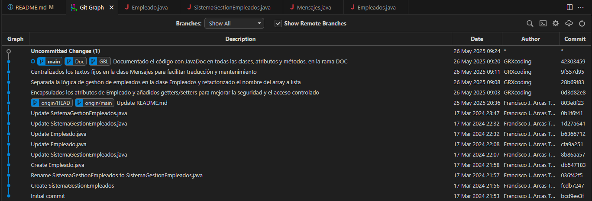

# Proyecto Refactorización de Empleados

**Autor:** Gonzalo Bernal López

## Descripción

Este proyecto consiste en la refactorización y documentación de un sistema de gestión de empleados en Java, siguiendo buenas prácticas de encapsulamiento, separación de responsabilidades y documentación JavaDoc.

## Visualización de ramas y commits

A continuación se muestra una captura de pantalla de la vista de ramas y commits del proyecto en Visual Studio Code:

